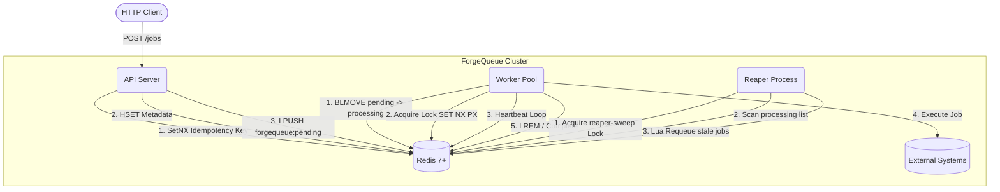

# ForgeQueue

A highly reliable, fault-tolerant, Redis-backed distributed job queue in Go. 

ForgeQueue is designed to explore and solve the edge cases of distributed systems, such as split-brain scenarios, process crashes, duplicate job submissions, and stale locks. It uses a custom-built distributed locking package, fencing tokens, and atomic Lua scripts to guarantee safe execution.

---

## Architecture

ForgeQueue splits the traditional job queue into three independent processes that coordinate entirely through Redis.



### Components

1. **API Server** (`cmd/api`): Exposes HTTP endpoints to enqueue jobs and check status. Handles deduplication via idempotency keys.
2. **Worker Pool** (`cmd/worker`): Pulls jobs off the queue atomically using `BLMOVE`. Secures a distributed lock per job, spawns a background heartbeat, and executes the job.
3. **Reaper** (`cmd/reaper`): A background fault-tolerance process. It scans for jobs in the `processing` list where the worker heartbeat has timed out (indicating a crashed worker) and atomically pushes them back to `pending` using a Lua script.

---

## Features

- **Atomic Dequeue**: Uses `LMOVE` to transition jobs from `pending` to `processing`. A job is never in a "limbo" state.
- **Idempotency**: Prevents duplicate submissions caused by client network retries using `SET NX EX`.
- **Distributed Locks**: Custom `internal/lock` package implementing `SET NX PX` with automatic background lease renewal.
- **Fencing Tokens**: Lock acquisitions return a monotonically increasing fencing token via `INCR` for safe external writes.
- **Lua Scripting**: Complex operations like the Reaper's staleness check-and-requeue and conditional lock releases are wrapped in Lua scripts for 100% atomicity.
- **Dead Letter Queue**: Jobs that exhaust their retry budget are moved to `forgequeue:dead`.
- **Observability**: Prometheus metrics natively exposed (`/metrics`) by all three services.

---

## Getting Started

### Prerequisites
- Docker & Docker Compose
- Go 1.25+ (if running locally)

### Running via Docker Compose

The easiest way to spin up the entire cluster (API, Worker, Reaper, Redis, Prometheus, Grafana) is via Docker Compose:

```bash
docker-compose up --build
```

> **Note**: Redis is mapped to port `6380` on the host to avoid conflicts with local `redis-server` instances. The API is exposed on port `8081`.

### API Usage

**1. Enqueue a Job**
```bash
curl -X POST http://localhost:8081/jobs \
  -H "Content-Type: application/json" \
  -d '{
    "type": "sleep",
    "payload": {"duration": 3},
    "max_retries": 3,
    "idempotency_key": "unique-request-123"
  }'
```

**2. Check Job Status**
```bash
curl http://localhost:8081/jobs/{job_id}
```

**3. View Queue Stats**
```bash
curl http://localhost:8081/queues/stats
```

---

## Why build this?

This project was built as a deep dive into the complexities of distributed coordination. While in-memory queues can rely on Go channels and `sync.Mutex`, a distributed queue requires network-aware equivalents. 

ForgeQueue was built alongside a companion project — **[Valkyr](https://github.com/lande26/valkyr)**, a Redis-compatible server written from scratch in Go.
